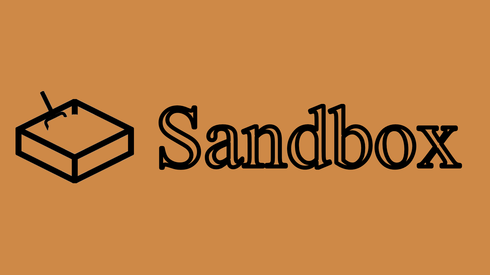

[Steam Workshop](https://steamcommunity.com/sharedfiles/filedetails/?id=3470116979) | 
[Changelogs](https://github.com/splitque/Sandbox/commits/release/)

**This is mod for Hearts of Iron 4 that aims to unlock the full "sandbox" potential of this game. All contries equal before each other, same focuses, politicals and etc. You can made what do you want, without vanilla "limitations", but bots can do what they want too!**

***Current HOI4 version: 1.16.-***

## Support

If you want to support development you can do so:

1. [Donate!](https://www.donationalerts.com/r/splitque)
2. If you find a bug, send it to [issues!](https://github.com/splitque/Sandbox/issues)
3. [Contribute!](https://github.com/splitque/Sandbox/pulls)

## Credits

- Thanks to [Chaos AI](https://steamcommunity.com/sharedfiles/filedetails/?id=1293066839) for agressive AI.